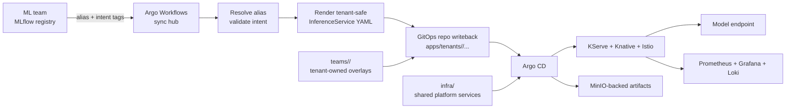

# Local-First Multi-Tenant ML Platform

Laptop-first Kubernetes MLOps platform for demonstrating real platform work:
multi-tenant GitOps ownership, MLflow-driven deployment intent, KServe serving,
and end-to-end observability on a reproducible local stack.

## What This Project Is For

This repo is a local-first MLOps platform reference stack and hands-on lab. It
is meant to show how a small multi-tenant ML platform can be structured around
GitOps, model registry intent, workflow-driven writeback, serving, and
observability without reducing the system to isolated tool demos.

It is also a working playground for people who want to learn or experiment with
Kubernetes, Argo CD, Argo Workflows, MLflow, KServe, Knative, Istio, MinIO, and
the operational surfaces around them by running the stack, inspecting it, and
changing it.

## Project Status

This is an active reference stack and hands-on lab for local experimentation,
learning, and portfolio demonstration. It is intended to be runnable,
inspectable, and modified, but it is not a production distribution.

For contribution guidance, see [CONTRIBUTING.md](CONTRIBUTING.md). For the lab
security posture and vulnerability reporting, see
[SECURITY.md](SECURITY.md).

## Architecture At A Glance



## Start Here

```bash
./bootstrap/install.sh
```

Install behavior:

- preserves an existing local `origin` remote such as GitHub or Codeberg
- creates or reconciles local `gitea` remote
- creates or reconciles the repo in in-cluster Gitea
- mounts Gitea repos and sqlite state on the host under `.local/gitea-data`
- wipes `.local/gitea-data` on each `./bootstrap/install.sh` so every fresh bootstrap starts from a clean in-cluster Gitea state
- pushes the current branch, makes the current local branch track `gitea/<branch>`,
  and reconciles that branch as the in-cluster repo default branch
- creates or updates the Argo CD root app (`ai-ml-root`)
- intentionally keeps the in-cluster GitOps repo path canonical as `gitops-admin/ai-ml.git` while reconciling its default branch to your current local branch

After bootstrap, your current branch's default `git pull`/`git push` target is
the in-cluster `gitea` remote because that is the repo Argo CD and workflow
writeback use. If you cloned from GitHub or Codeberg, that original `origin`
remote is still there, but pushing back to it becomes an explicit action such
as `git push origin <branch>`.

After install, the cluster exists but the platform will still be reconciling
through Argo CD. On a cold bootstrap, expect additional time for services to
settle. Log into Argo CD to watch that progress.

1. Run the endpoint and health discovery helper:

   ```bash
   ./bootstrap/discover-endpoints.sh
   ```

   It prints:
   - direct URLs for Argo CD, Gitea, MinIO, Grafana, and MLflow
   - login credentials and notes
   - Argo CD application health
   - `/etc/hosts` lines for local DNS convenience

2. If core applications are still reconciling or degraded, wait a few minutes
   and run `./bootstrap/discover-endpoints.sh` again.
3. Add the printed `/etc/hosts` block so ingress-backed hostnames resolve
   locally.
4. Open Argo CD, Gitea, Grafana, and MLflow using the URLs from
   `discover-endpoints.sh`, then inspect the app tree and platform state.
5. Train and promote the baseline model:

   ```bash
   python3 teams/ml-team-a/mlflow/scripts/train_xgboost_and_promote_champion.py
   ```

6. Watch the generated manifest appear under
   `apps/tenants/ml-team-a/deployments/` and watch Argo CD reconcile it.
7. Verify inference over the mesh:

   ```bash
   ./scripts/team_a_xgboost_inference_test.sh
   ```

8. Review the serving, workflow, and platform dashboards inside Grafana.

## Validate

```bash
make validate
```

Validation covers:

- shell syntax for bootstrap and helper scripts
- Python bytecode compilation for workflow and training scripts
- unit tests for the tenant-safe manifest renderer
- `kustomize` builds for every checked-in `kustomization.yaml` using standalone
  `kustomize` when available, otherwise `kubectl kustomize`
- `shellcheck` when installed

## Default Platform Profile

Static LoadBalancer IPs:

- Argo CD: `172.29.0.200`
- Gitea HTTP: `172.29.0.201`
- Gitea SSH: `172.29.0.202`
- Istio ingress gateway: `172.29.0.203`
- MinIO API and console: `172.29.0.204`
- Grafana: `172.29.0.205`

GitOps layering:

- `ai-ml-root` -> `clusters/kind/bootstrap`
- bootstrap -> `infra/`
- `infra/argocd` -> team roots (`ml-team-a-root`, optional `ml-team-b-root`)
- team root -> `teams/<team>/`
- tenant deployment state -> `apps/tenants/<team>/...`

Platform components:

- Gitea with host-mounted persistence
- Argo CD `v3.3.6`
- Argo Workflows `v3.7.3`
- cert-manager `v1.19.1`
- Istio `1.24.2`
- Knative Serving `v1.20.x` with `net-istio`
- KServe `v0.16.0`
- MLflow chart `1.7.3`
- MinIO with host-mounted persistence
- Monitoring with Grafana, Prometheus, Loki, and Promtail
- Runtime and queue-sidecar hardening for local serving stability

Default team-a deployment path:

- workflow-managed manifests live under `apps/tenants/ml-team-a/deployments/`
- stale workflow-managed manifests are pruned automatically when a model drops
  out of alias discovery
- repeated sync polls should settle to `noop/no_diff` when intent is unchanged

## Intentional Simplifications

Production-like:

- toolchain and control flow
- declarative GitOps lifecycle
- multi-component serving behavior
- debugging surface through metrics, logs, and workflow status

Intentionally simplified for laptop use:

- HA and long-term retention
- enterprise auth and secret-management posture; checked-in credentials and
  security defaults are for lab use only and are not production-fit
- compliance and environment-specific controls
- one active tenant by default to keep the stack practical on constrained
  hardware

## Repo Layout

```text
bootstrap/          Cluster lifecycle scripts
infra/              Shared platform services and reusable bases
  argocd/           Team root Argo CD applications
  mlflow/base/      Shared MLflow base templates/defaults
  argo-workflows/   Shared workflow automation
teams/              Team-owned layer (MLflow/model/netpol/quotas/workflows)
apps/               Tenant-owned deployment targets and example workloads
clusters/           Cluster-specific GitOps overlays
docs/               Architecture, ownership, and troubleshooting docs
scripts/            Validation, troubleshooting, and demo helpers
tests/              Lightweight unit tests for repo-owned platform glue
```

## Further Reading

- [docs/architecture.md](docs/architecture.md)
- [docs/multi-tenant-gitops.md](docs/multi-tenant-gitops.md)
- [docs/why-this-project-exists.md](docs/why-this-project-exists.md)
- [docs/troubleshooting.md](docs/troubleshooting.md)
- [CONTRIBUTING.md](CONTRIBUTING.md)
- [SECURITY.md](SECURITY.md)
- [CODE_OF_CONDUCT.md](CODE_OF_CONDUCT.md)
